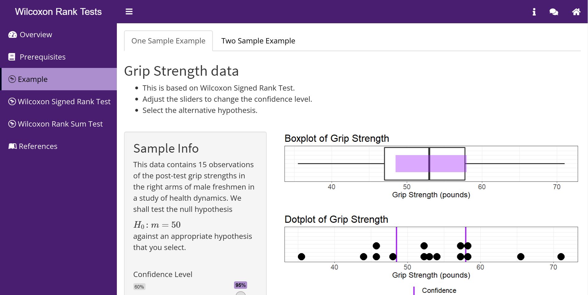

# Wilcoxon Rank Tests

# App Description
This app allows students to explore the concept of two non-parametric tests called Wilcoxon Signed Rank Test for one sample data or two sample unpaired data and Wilcoxon Rank Sum Test for two sample paired data.
